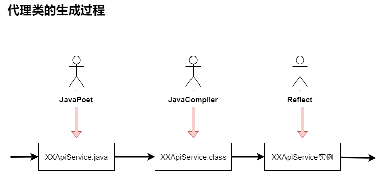
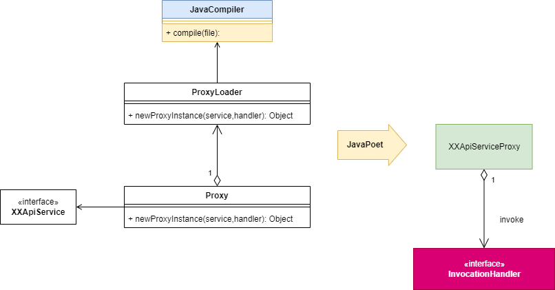

# 手动实现动态代理
首先要明确一点，代理是为了什么，为了控制对象访问，由代理者决定该如何调用被代理的对象

## 1.静态代理及其缺陷

代理类Proxy能够在执行真实类之前做一些额外的操作，例如统计运行时长。

但是存在的问题是：

- 1.如果真实类有100个方法要被代理，那么代理类就需要同时增加100个相似的逻辑
- 2.如果需要被代理的类有100个，那么对应的代理类也要增加100个

这种场景就是，我们需要使用同一个代理类来实现代理任意对象的任意方法。  这时就需要使用到动态代理了

## 2.概述

### 2.1 思路（设想）
从上面看我们要实现对任意真实类的所有方法进行代理，首先想到的是反射。

可以做的事情是：

1）我们可以拿到真实类的Class信息，因此可以反射找到真实类中的所有方法

2）拿到对应方法之后，我们需要对方法进行改造，在原有方法基础上，增加上我们自己的逻辑 （问题：用什么方式承载改造后的代码）

所以我们希望有一个和真实类Class中的方法全部一模一样的类（首先想到的是继承或者实现），然后所有的方法都转交到真实类并补充增加的逻辑。

由于我们新增的逻辑在多个方法中样式可能都是一模一样的，因此我们希望所有方法都有一个统一的入口。

因此我们的愿景是**能够通过动态生成某个java类文件，实现了真实类的某个父类或接口（能够通过它们找到真实类的所有方法），然后归并所有方法一个统一的入口。**

### 2.2 方案
由于静态代理会导致类的膨胀，需要使用动态代理，静态代理中一个类只能代理一个类。而动态代理为了使得创建一个InvocationHandler就能够调用任意一个目标被代理的类，一种代码解决所有情况。

动态代理其实本质上就是运用静态代理的基础，通过动态生成静态代理类，然后运行代理类的过程。
要动态生成静态代理类，并动态编译之后运行：

- 动态生成代码 那么需要用到APT类似的方式，最常见的java代码生成工具是javaPoet
- 编译生成的代码 使用jdk的编译工具编译并生成.class文件
- 加载class文件并创建代理对象
- 运行代理对象

## 3.手撸动态代理
我们通过Gradle管理工程，通过Gradle工具创建一个kotlin的应用工程。

注：gradle并不是必须的，只是为了管理工程方便使用，具体创建方式见[gradle官方文档](https://docs.gradle.org/current/samples/sample_building_java_applications.html)

### 3.1 动态生成代理类文件
我们先编写一个接口

	interface ApiService {
	
	    fun getBanner(): List<String>
	
	    fun login(): Boolean
	}

并增加一个实现类，用于作为后面的真实类

	class RealApiService: ApiService {
	    override fun getBanner(): List<String> {
	        return listOf("banner")
	    }
	
	    override fun login(): Boolean {
	        return true
	    }
	}

现在我们需要做的就是生成一个RealApiService的代理类，代码逻辑大致是这样

	public class ApiServiceProxy implements ApiService {
	  private RealApiService realSubject;
	
	  public ApiService_Proxy(RealApiService realSubject) {
	    this.realSubject = realSubject;
	  }
	
	  @Override
	  public List getBanner() {
	    return realSubject.getBanner();
	  }
	
	  @Override
	  public boolean login() {
	    return realSubject.login();
	  }
	}

我们利用JavaPoet来实现该类文件的生成逻辑。

	object Proxy {
	
	    fun packageName(clazz: Class<*>) = clazz.`package`.name
	
	    fun proxyFileName(clazz: Class<*>) = "${clazz.simpleName}Proxy"
	
	    fun newProxyInstance(realApiService: RealApiService, interfaces: Class<*>){
	        val typeBuilder = TypeSpec.classBuilder(proxyFileName(interfaces))
	            .addModifiers(Modifier.PUBLIC)
	            .addSuperinterface(interfaces)
	            .addAnnotation(
	                // 抑制警告信息
	                AnnotationSpec
	                    .builder(SuppressWarnings::class.java)
	                    .addMember("value", "\$S","unchecked")
	                    .build()
	            )
	
	        // 创建成员变量，即真实类实例
	        val fieldSpec = FieldSpec.builder(
	            realApiService.javaClass,
	            "realSubject",
	            Modifier.PRIVATE
	        ).build()
	
	        typeBuilder.addField(fieldSpec)
	
	        // 创建需要传入ApiService实例的构造方法
	        val constructor = MethodSpec.constructorBuilder()
	            .addModifiers(Modifier.PUBLIC)
	            .addParameter(realApiService.javaClass, "realSubject") // 添加参数
	            .addStatement("this.realSubject = realSubject")
	            .build()
	
	        typeBuilder.addMethod(constructor)
	
	        // 找到所有的方法
	        for(method in interfaces.declaredMethods){
	            val methodSpec = MethodSpec.methodBuilder(method.name)
	                .addModifiers(Modifier.PUBLIC)
	                .addAnnotation(Override::class.java)
	                .returns(method.returnType)
	                .addStatement("return realSubject.${method.name}()")
	                .build()
	
	            typeBuilder.addMethod(methodSpec)
	        }
	
	        JavaFile.builder(
	            packageName(interfaces),
	            typeBuilder.build()
	        ).build().apply {
	            writeTo(File(App.PKG_ROOT_PATH))
	        }
	    }
	}

执行生成逻辑：

	class App {
	
	    companion object{
	        const val PKG_ROOT_PATH = "./app/src/main/kotlin/"
	        const val BUILD_CLASS_ROOT = "./app/build/classes/kotlin/main/"
	
	        fun getProxyFilePath(clazz: Class<*>): String {
	            val pathBuilder = StringBuilder(PKG_ROOT_PATH)
	                .append(Proxy.packageName(clazz).replace(".", "/"))
	                .append("/")
	                .append(Proxy.proxyFileName(clazz))
	                .append(".java")
	            return pathBuilder.toString()
	        }
	    }
	
	    val greeting: String
	        get() {
	            return "Hello World!"
	        }
	
	}
	
	fun main() {
	    val realSubject = RealApiService()
	    Proxy.newProxyInstance(realSubject,  ApiService::class.java)
	}

我们将会看到与RealApiService同目录下生成的RealApiServiceProxy.java文件

### 3.2 编译、加载代理类
生成了java文件后，我们需要将java文件编译成class文件才能被类加载器ClassLoader加载。(在APT中可以直接调用是因为有帮助我们编译)

#### 1）编译生成的类
我们首先编写一个编译工具方法

[JavaCompiler.kt](app/src/main/kotlin/com/hudson/dynamic_proxy/compiler/JavaCompiler.kt)

	fun compile(javaFile: File){
	    ToolProvider.getSystemJavaCompiler().run {
	        val fileManager = getStandardFileManager(null, null, null)
	        val options = listOf("-Xlint:unchecked") // 增加lint检查日志
	        getTask(null,
	            fileManager,
	            null,
	            options,
	            null,
	            fileManager.getJavaFileObjects(javaFile)
	        ).call()
	        fileManager.close()
	    }
	}

执行编译，我们会看到有对应的RealApiServiceProxy.class文件生成

#### 2）加载类
一般情况下我们会通过Class.forName()或者ClassLoader.loadClass()来加载指定的类，但本质都还是通过ClassLoader去加载的。

但是平时我们使用Class.forName()其实是所对应的class文件都位于ClassLoader的搜索路径下，由于我们产生的class文件处于java源文件的同目录，而默认ClassLoader不会搜索这个目录，因此通过Class.forName()或者拿到某个类的classLoader执行loadClass是行不通的。

考虑有两种方案：

**方式一：既然搜索路径不包含在默认ClassLoader下，我们可以手动把class文件复制到对应的搜索路径下**

	fun main() {
	    val realSubject = RealApiService()
	    Proxy.newProxyInstance(realSubject,  ApiService::class.java)
	
	    val clazz = RealApiService::class.java
	
	    // 编译
	    compile(File(App.getProxyFilePath(clazz)))
	
	    val loadClass = {
			// 把class文件复制到build相关目录下
	        val pkgPath = Proxy.packageName(clazz).replace(".", "/")
	        File(App.getProxyFilePath(clazz).replace(".java", ".class")).copyTo(
	            File("${App.BUILD_CLASS_ROOT}$pkgPath/${Proxy.proxyFileName(clazz)}.class"),
	            true
	        )
	        Class.forName(
	            "${Proxy.packageName(clazz)}.${Proxy.proxyFileName(clazz)}",
	            false, App::class.java.classLoader)
	    }
	
	    val proxyInstance = loadClass()
	        .getConstructor(RealApiService::class.java)
	        .newInstance(realSubject) as ApiService
	
	
	    println(proxyInstance.getBanner())
	}

这样用代理生成类就可以正常执行逻辑了。

**方式二：手动新创建一个ClassLoader，并设置搜索路径，用新建的ClassLoader去加载这个类**

	fun main() {
	    val realSubject = RealApiService()
	    Proxy.newProxyInstance(realSubject,  ApiService::class.java)
	
	    val clazz = RealApiService::class.java
	
	    // 编译
	    compile(File(App.getProxyFilePath(clazz)))
	
	    // 加载
	    val loadClass = {
			// 注意：路径根据自身情况配置，与电脑设备磁盘相关
	        val clazzLoadPath = "F:/projects/Dynamic-Proxy/${App.PKG_ROOT_PATH}"
	        val classLoader = URLClassLoader(arrayOf(URL("file:/$clazzLoadPath")))
	        classLoader.loadClass("${Proxy.packageName(clazz)}.${Proxy.proxyFileName(clazz)}")
	    }
	
	    val proxyInstance = loadClass()
	        .getConstructor(RealApiService::class.java)
	        .newInstance(realSubject) as ApiService
	
	
	    println(proxyInstance.getBanner())
	}

注意：路径根据自身情况配置，与电脑设备磁盘相关

自此类实例的创建过程完毕，整体过程：

### 3.3 支持任意类任意方法
#### 1）支持任意类
支持任意类，上面逻辑中已经实现，只需要我们提供接口的class和一个真实类（实现类）即可。

但是上面逻辑还可以更简化，我们可以直接通过真实类获取到接口类型class。
#### 2)支持任意方法
要支持任意方法，意味着需要**把方法的逻辑处理权交给外界自行处理**。

我们可以反射找到对应的方法直接抛给外面处理，因此就还需要一个接管这个抛出方法的类，Handler，为了更形象地描述这个类的功能是处理抛出方法的调用逻辑，因此我们命名为 InvocationHandler

另外，由于方法的具体逻辑都抛出交给InvocationHandler处理了，所以代理类中持有真实类的意义也就不存在了。

#### 代码实现
经过上面分析，Proxy代理类的实现只需要让外界传入一个真实类的class即可。

另外需要注意的是，外部传入的真实类可能有实现多个接口，因此生成代理类时需要遍历所有接口。

我们大概要实现的代理类代码是这样的：

	public class RealApiServiceProxy implements ApiService {
	  private InvocationHandler handler;
	
	  public RealApiServiceProxy(InvocationHandler handler) {
	    this.handler = handler;
	  }
	
	  @Override
	  public void voidReturn() {
	    try {
	    	Method method = com.hudson.dynamic_proxy.real.ApiService.class.getMethod("voidReturn");
			// 1.返回类型
	    	handler.invoke(method);
	    } catch(Exception e){ 
	    	e.printStackTrace();
	    }
	  }

	  @Override
	  public String withParam(String arg0) {
	    try {
			// 2.带参方法
	    	Method method = com.hudson.dynamic_proxy.real.ApiService.class.getMethod("withParam",new Class<?>[]{String.class});
			// 1.返回类型
	    	return (String)handler.invoke(method,arg0);
	    } catch(Exception e){ 
	    	e.printStackTrace();
	    }
	    return null;
	  }
	}

我们优化上面通过JavaPoet生成代理java类文件的逻辑。需要注意的几个点：

- 1.方法返回类型的处理。 如果有返回类型，由于Handler默认返回Object(kotlin中Any)类型，因此需要强转; 如果是基本数据类型，还需要注意不能返回null作为默认值；如果没有返回类型，则不需要return语句
- 2.反射获取方法时，需要携带上方法参数定位方法。  而JavaPoet中对于new Class<?>[]{} 数组处理较为繁琐。

具体参考代码[Proxy.kt](app/src/main/kotlin/com/hudson/dynamic_proxy/Proxy.kt)

另外前面我们都是在main入口函数处通过Class.forName或ClassLoader.loadClass加载了类，但通过分析系统提供的动态代理，实际上Proxy.newProxyInstance是已经帮助我们创建好了实例，因此我们可以把编译，加载以及创建代理实例的逻辑移入newProxyInstance方法中。

为了细化各个类的实际功能，我们将移入的逻辑放入一个新的类中（作为Proxy的内部类），并命名为ProxyLoader，它的逻辑如下：

	class ProxyLoader {

        fun newProxyInstance(clazz: Class<*>, handler: InvocationHandler): Any {
            // 编译
            compile(File(getProxyFilePath(clazz)))

            // 加载，并创建实例
            return loadProxyClass(clazz)
                .getConstructor(InvocationHandler::class.java)
                .newInstance(handler)
        }

        private fun loadProxyClass(clazz: Class<*>, copyToBuildDir: Boolean = true): Class<*> {
            // 注意：当应用程序编译运行后，实际上会在app/build/classes目录中生成对应的class文件
            // 而ClassLoader会在这里面查找并加载相关类
            // 由于我们的生成类是经过我们编译生成的class文件，因此应用自身的ClassLoader是无法加载到我们
            // 产出的class的。 有两种方案：
            // 1.将class编译结果路径也放到build目录下
            // 2.新建一个ClassLoader手动加载我们的class文件

            // 方式一：将产生的class文件复制到build目录下
            val packageName = packageName(clazz)
            val proxyFileName = proxyFileName(clazz)
            return if(copyToBuildDir){
                val pkgPath = packageName.replace(".", "/")
                File(getProxyFilePath(clazz).replace(".java", ".class")).copyTo(
                    File("${BUILD_CLASS_ROOT}$pkgPath/$proxyFileName.class"),
                    true
                )
                Class.forName(
                    "$packageName.$proxyFileName",
                    false, App::class.java.classLoader)
            }else{
                // 方式二：新建ClassLoader并设置搜索路径
                val clazzLoadPath = "${CLASS_LOADER_FIND_ROOT}${PKG_ROOT_PATH}"
                val classLoader = URLClassLoader(arrayOf(URL("file:/$clazzLoadPath")))
                classLoader.loadClass("$packageName.$proxyFileName")
            }
        }

        private fun getProxyFilePath(clazz: Class<*>): String {
            val pathBuilder = StringBuilder(PKG_ROOT_PATH)
                .append(packageName(clazz).replace(".", "/"))
                .append("/")
                .append(proxyFileName(clazz))
                .append(".java")
            return pathBuilder.toString()
        }
    }

### 3.4 验证代码可行性
考虑到外界可能直接传递一个接口类型Class，因此增加对接口类型的支持。

	fun main() {
	    val realSubject = RealApiService()
	    val handler = object : InvocationHandler {
	        override fun invoke(method: Method, vararg args: Any?): Any? {
	            if(method.name == "getBanner"){
	                // 对真实类的结果进一步处理
	                val sourceResult = method.invoke(realSubject) as List<String>
	                return mutableListOf("hello", "world").apply {
	                    addAll(sourceResult)
	                }
	            }
	            if(method.name == "withParam" && args[0] is String){
	                // 不考虑真实类的处理逻辑，直接使用自定义逻辑
	                return "${args[0]}hudson"
	            }
	            return null
	        }
	    }
	    val proxyInstance = Proxy.newProxyInstance(RealApiService::class.java, handler) as ApiService
	
	
	    println("无参方法-代理结果：${proxyInstance.getBanner()}")
	    println("有参方法-代理结果：${proxyInstance.withParam("Greet from: ")}")
	
	    // 其实这里的匿名Handler完全可以直接使用上面的Handler
	    val testServiceInstance = Proxy.newProxyInstance(TestService::class.java, object: InvocationHandler{
	        override fun invoke(method: Method, vararg args: Any?): Any? {
	            if(method.name == "printContent" && args.size == 1){
	                println("直接代理接口-代理结果：${args[0]}")
	            }
	            return null
	        }
	    }) as TestService
	
	    testServiceInstance.printContent("JavaPoet")
	}

我们可以看到我们自定义的动态代理成功：

		
	无参方法-代理结果：[hello, world, banner]
	有参方法-代理结果：Greet from: hudson
	直接代理接口-代理结果：JavaPoet
	
	Process finished with exit code 0
	
这样我们就实现了对任意类任意方法的代理了。

### 3.5 总结
至此基本类图结构如下：

## 4.系统提供的动态代理分析
我们来分析官方提供的动态代理。

	  public static Object newProxyInstance(ClassLoader loader,
                                          Class<?>[] interfaces,
                                          InvocationHandler h)

有三个参数：

第一个ClassLoader，

第二个传递一个Class数组，我们是直接通过外界传入的Service的class拿到了interfaces，然后逐个遍历内部的方法的。

第三个参数与我们的InvocationHandler类似。但是InvocationHandler的invoke方法相比我们自定义的InvocatinoHandler中的多了一个参数Proxy。

	public @Nullable Object invoke(Object proxy, Method method, @Nullable Object[] args)

那么第一个参数proxy的作用何在？proxy就是代理类，也就是我们的InvocationHandler。  该参数存在的意义在于对于那种需要返回this的方法情况，例如链式调用中使用。

**注意：InvocationHandler的invoke方法中执行时一定要避免使用第一个参数运行method，否则结果就是自己调用自己，形成死循环。**

### 4.1 分析系统源码

	 @CallerSensitive
    public static Object newProxyInstance(ClassLoader loader,
                                          Class<?>[] interfaces,
                                          InvocationHandler h)
        throws IllegalArgumentException
    {
        
        /*
		 * 1.查找或创建Proxy类
         * Look up or generate the designated proxy class.
         */
        Class<?> cl = getProxyClass0(loader, intfs);

        /*
         * 2.调用其构造方法创建实例
         * Invoke its constructor with the designated invocation handler.
         */
        try {
            // Android-removed: SecurityManager / permission checks.
            /*
            if (sm != null) {
                checkNewProxyPermission(Reflection.getCallerClass(), cl);
            }
            */

            final Constructor<?> cons = cl.getConstructor(constructorParams);
            final InvocationHandler ih = h;
            if (!Modifier.isPublic(cl.getModifiers())) {
                // BEGIN Android-removed: Excluded AccessController.doPrivileged call.
                /*
                AccessController.doPrivileged(new PrivilegedAction<Void>() {
                    public Void run() {
                        cons.setAccessible(true);
                        return null;
                    }
                });
                */

                cons.setAccessible(true);
                // END Android-removed: Excluded AccessController.doPrivileged call.
            }
            return cons.newInstance(new Object[]{h});
        } catch (IllegalAccessException|InstantiationException e) {
            throw new InternalError(e.toString(), e);
        } catch (InvocationTargetException e) {
            Throwable t = e.getCause();
            if (t instanceof RuntimeException) {
                throw (RuntimeException) t;
            } else {
                throw new InternalError(t.toString(), t);
            }
        } catch (NoSuchMethodException e) {
            throw new InternalError(e.toString(), e);
        }
    }

可以看出系统提供的逻辑跟我们差不多，首先要编译加载类信息，然后根据类拿到构造方法创建实例。

我们继续看加载类信息的逻辑

	 private static Class<?> getProxyClass0(ClassLoader loader,
                                           Class<?>... interfaces) {
        if (interfaces.length > 65535) {
            throw new IllegalArgumentException("interface limit exceeded");
        }

        // If the proxy class defined by the given loader implementing
        // the given interfaces exists, this will simply return the cached copy;
        // otherwise, it will create the proxy class via the ProxyClassFactory
        return proxyClassCache.get(loader, interfaces);
    }

可以看出系统动态代理提供了一个缓存，用于缓存已经加载的代理类信息。

我们看proxyClassCache字段
	
	    private static final WeakCache<ClassLoader, Class<?>[], Class<?>>
        	proxyClassCache = new WeakCache<>(new KeyFactory(), new ProxyClassFactory());

有一个ProxyClassFactory，从字面上可以看出这就是ProxyClass的构建工厂。  如果知晓缓存一般的设计思路的同学应该都知道，设计缓存都是先从缓存中获取，获取不到新建，很明显，ProxyClassFactory就是新建代理类的工厂。

	@Override
        public Class<?> apply(ClassLoader loader, Class<?>[] interfaces) {

            Map<Class<?>, Boolean> interfaceSet = new IdentityHashMap<>(interfaces.length);
            for (Class<?> intf : interfaces) {
                /*
                 * Verify that the class loader resolves the name of this
                 * interface to the same Class object.
                 */
                Class<?> interfaceClass = null;
                try {
                    interfaceClass = Class.forName(intf.getName(), false, loader);
                } catch (ClassNotFoundException e) {
                }
                if (interfaceClass != intf) {
                    throw new IllegalArgumentException(
                        intf + " is not visible from class loader");
                }
                /*
                 * Verify that the Class object actually represents an
                 * interface.
                 */
                if (!interfaceClass.isInterface()) {
                    throw new IllegalArgumentException(
                        interfaceClass.getName() + " is not an interface");
                }
                /*
                 * Verify that this interface is not a duplicate.
                 */
                if (interfaceSet.put(interfaceClass, Boolean.TRUE) != null) {
                    throw new IllegalArgumentException(
                        "repeated interface: " + interfaceClass.getName());
                }
            }

            String proxyPkg = null;     // package to define proxy class in
            int accessFlags = Modifier.PUBLIC | Modifier.FINAL;

            /*
             * Record the package of a non-public proxy interface so that the
             * proxy class will be defined in the same package.  Verify that
             * all non-public proxy interfaces are in the same package.
             */
            for (Class<?> intf : interfaces) {
                int flags = intf.getModifiers();
                if (!Modifier.isPublic(flags)) {
                    accessFlags = Modifier.FINAL;
                    String name = intf.getName();
                    int n = name.lastIndexOf('.');
                    String pkg = ((n == -1) ? "" : name.substring(0, n + 1));
                    if (proxyPkg == null) {
                        proxyPkg = pkg;
                    } else if (!pkg.equals(proxyPkg)) {
                        throw new IllegalArgumentException(
                            "non-public interfaces from different packages");
                    }
                }
            }

            if (proxyPkg == null) {
                // if no non-public proxy interfaces, use the default package.
                proxyPkg = "";
            }

            {
                // Android-changed: Generate the proxy directly instead of calling
                // through to ProxyGenerator.
                List<Method> methods = getMethods(interfaces);
                Collections.sort(methods, ORDER_BY_SIGNATURE_AND_SUBTYPE);
                validateReturnTypes(methods);
                List<Class<?>[]> exceptions = deduplicateAndGetExceptions(methods);

                Method[] methodsArray = methods.toArray(new Method[methods.size()]);
                Class<?>[][] exceptionsArray = exceptions.toArray(new Class<?>[exceptions.size()][]);

                /*
                 * Choose a name for the proxy class to generate.
                 */
                long num = nextUniqueNumber.getAndIncrement();
                String proxyName = proxyPkg + proxyClassNamePrefix + num;

                return generateProxy(proxyName, interfaces, loader, methodsArray,
                                     exceptionsArray);
            }
        }
    }

    @FastNative
    private static native Class<?> generateProxy(String name, Class<?>[] interfaces,
                                                 ClassLoader loader, Method[] methods,
                                                 Class<?>[][] exceptions);

可以看到最后部分generateProxy方法，创建代理类的地方。

可以看出创建代理类的逻辑是native方法完成的（注意：这里看的是android中带的Proxy类，原始JDK中是借助了ProxyGenerator实现的）。

### 4.2 动态代理与AOP
我们在不修改原来代码的情况下，给原来的类的方法上插入了自定义的逻辑。

这点非常像字节码插桩的操作，即对生成的class文件进行修改，而不会影响到实际的原始代码，对上层用户无感知。

这就是AOP编程模型（面向切面编程）。

相当于传统的编程模型，AOP的思考点是：找到匹配的切入点，插入自定义逻辑，而且这种插入对原有框架代码是无侵入性的。相对于面向对象编程模型使用继承的方式进行扩展这种侵入性的处理方式，显然是一个巨大的进步。

## 5.十万个为什么
### 5.1 为什么JDK动态代理只能基于接口实现？
因为JDK动态代理生成的类默认要继承自Proxy类，由于不支持多继承，因此只能基于接口。 这点我们也可以从JDK的Proxy类的说明看到

	Proxy provides static methods for creating dynamic proxy
	  classes and instances, and it is also the superclass of all
	  dynamic proxy classes created by those methods.

## 参考
1. [10分钟看懂动态代理设计模式](https://www.jianshu.com/p/fc285d669bc5)
2. [10分钟看懂动态代理设计模式（升级篇）](http://youngfeng.com/2019/11/29/10%E5%88%86%E9%92%9F%E7%9C%8B%E6%87%82%E5%8A%A8%E6%80%81%E4%BB%A3%E7%90%86%E8%AE%BE%E8%AE%A1%E6%A8%A1%E5%BC%8F%EF%BC%88%E5%8D%87%E7%BA%A7%E7%AF%87%EF%BC%89/)